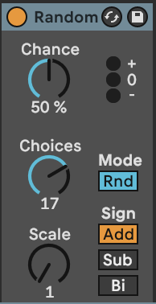
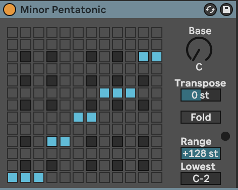

---
---
---

# Tools - MIDI tools: chords and added notes

There are many tools within Ableton Live 11 and Max for Live that will generate (random) chords for you. In [Process - Note-wise probability] we looked at generating chords randomly by stacking MIDI notes in a clip, then applying probability to randomly select which notes to sound. This produced a chord that changed everytime the MIDI clip looped around.

------------------------------------------------------------------------

## Key idea {.unnumbered}

Adding notes, changing the lengths of notes and generating chords within a given scale using MIDI plugin tools can form the basis of a generative, ambient piece. Using other MIDI plugins to arpeggiate these chords and add additional notes and harmonies will produce a constantly evolving sequence of MIDI notes within the scale.

------------------------------------------------------------------------

## Ableton's Note Echo plugin

Ableton's Note Echo plugin may at first seem a bit pointless. I mean you can take the output from an audio track and just apply a Delay or Echo to that, so why bother doing it on the MIDI side? Well, because with Note Echo it will adjust the velocity of each echoed note, and you can also pitch up or down the echos, leading to changing pitch. You can also combine Note Echo plugins to produce nice "multi-tap" delays, each with different characteristics. The echos can build up quickly if you stack these, so I tend to use them with minimal or no feedback. Combined with the Random plugin discussed below you can easily build up evolving and interesting patterns which are similar without repeating. The "Feed Delay" amount controls the amount that the velocity decays with each repeat.

<!-- -->

## Ableton's Random plugin

The Random plugin changes the pitch of the incoming note within a range specified within the plugin. In the example shown below, incoming notes will be randomised to an increase in pitch up to 17 semi-tones above the original note with 50% probability (flip of a coin). The "Sign" switches allow you to define whether the random pitch change is added, subtracted or either to the incoming note. The "Mode" switch allows you to swap between randomness and incrementing, if you want the pitch to change gradually with each incoming note.

<!-- -->

## Ableton's Note Length plugin

Note Length is a really useful plugin to help modify the incoming MIDI and make notes longer or shorter. The "Gate" control can be used to double an incoming notes length, while the "Length" control defines the length of the resulting MIDI note in milliseconds or seconds. I use this to take incoming MIDI information and "smear" it for use with pad sounds. This is useful in generative ambient music, because you can relate the pad chord using these smeared notes to any incoming moving MIDI part. Be aware though that with long "Length" settings used with many incoming notes, it's possible to stack up MANY midi voices in a plugin. Limiting the number of voices in the plugin instrument or reducing the note length can prevent CPU overload!

<!-- -->

## Ableton's Scale plugin

The Scale plugin is the Generative Ambient musician's friend. It takes whatever MIDI nonsense you through at it and quantises it to a given scale. ***This isn't cheating.*** Well, it kind of is, but it's a well used cheat within the modular synthesis world where quantisers have been used for a long time to ensure that control voltage (CV) signals conform to a particular scale.

<!-- -->

## Ableton's Chord plugin

Ableton's Chords plugin adds notes to incoming MIDI notes to form chords. Up to six additional tones can be added to the incoming MIDI. Each tone has its own associated velocity which can help accentuate certain parts of the chord over others. The Chord plugin adds notes to ***every*** MIDI note it receives, and in fixed intervals above or below that incoming MIDI note. So again, it may be a good idea to use the Scale plugin to ensure that the generated notes and chords fall within a desired scale.

<!-- -->

Coupling the Chord plugin with the Arpeggiator and Random plugins is a good way to make arpeggiated lines that do not repeat exactly. As with most of these MIDI plugins the order you specify them can provide interesting variations. So Chord -\> Arpeggiator -\> Random -\> Scale adds random notes into the arpeggio resulting in cascades of notes that change note to note, but within a constrained set of output notes. Random -\> Chord -\> Arpeggio -\> Scale would lead to a consistent arpeggio for the duration of the input note but could be different for each cycle of the generating MIDI loop.

## Max for Live Chord Generator plugin

The [Nordmann Chord Generator](https://maxforlive.com/library/device/917/chord-generator) Max for Live plugin.

<!-- -->

## Max for Live Tintinnabulator plugin

The [Tintinnabulator](https://maxforlive.com/library/device/7569/tintinnabulator) Max for Live plugin by Milton Mermikedes is an implementation of Arvo Part's [Tintinnabulation technique](https://en.wikipedia.org/wiki/Tintinnabuli). This technique arpeggiates the original chord, and then adds additional notes / harmonies to those notes based on the nearest tone from the scale triad. So 1st position inferior C minor takes a C minor triad (C - Eb - G) and assigns a harmony to the incoming notes using the nearest chord tone 1 position lower than the incoming note (the M-Voice). Within the plugin you can specify the delay between the original notes and the additional harmonies. The good news for producers of generative, ambient music is that the choice of T-Voice position (1st Superior, 2nd Superior, 1st Inferior, 2nd Inferior) can be set to be random. This will add variety and keeps the T-Voice harmony changing. This plugin can be used on melody lines or chord inputs for a variety of different effects.

<!-- -->

## Max for Live Schwartzonator plugin

The Schwartzonator plugin
