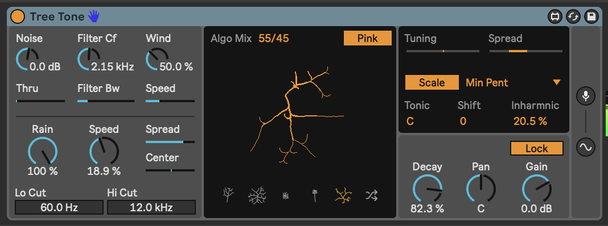

---
---
---

# Tools - Audio Generators

------------------------------------------------------------------------

## Key idea {.unnumbered}

MIDI generators (as discussed in [Tools - MIDI Generators] produce MIDI notes which can be further processed via the MIDI plugins that we explored in [Tools - Chords and added notes] and then played through instruments. But Ableton Live also has some sound generators that will produce sounds without the need of MIDI input or in fact ***any*** input. We just need to think a little creatively and use a generous number of Audio plugins to process the sound into the shape we would like. These sound generators are more likely to produce drones and textures than melodies, so may augment some of the tools previously discussed.

------------------------------------------------------------------------

## Tree Tone

From the Inspired by Nature pack by Dillon Bastan this is primarily a resonant drone generator but with some additional bells and whistles.

<!-- -->

## Harmonic Drone Generator

Does exactly what is says on the tin. This is a drone generator from the Drone Lab pack in Ableton Suite.

<!-- -->

## Cellular Degradation

This is a [paid plugin by Dillon Bastan](https://dillonbastan.gumroad.com/l/yyehc?layout=profile) which features six tone generating synthesis engines with a generator mechanism based on cellular growth and decay. If you're familiar with Conway's "Game of Life" then this concept might be familiar, but basically cells are generated and rules govern whether that cell will continue to survive or decay depending on the state of neighbouring cells. So if a new cell has surrounding cells which are alive, it will "survive", but if there aren't sufficient live cells neighbouring then it will decay. The "Born" rule will spawn new cells adjacent to the clicked cell

The six tone generators work in L+R pairs, so there are actually 12 sets of parameters that can be affected by the cell values if the "Voices" is set to 6. Different parameters of the tone generators are shown to the right of the square display and by clicking on the row for each parameter, it will set the value for that parameter using the "Value" scaling to the bottom left of the square display. This then scales the range of possible values for each parameter which shows the offset / lowest value (left % number) and the range (right % number).

So what this gives us is a way of generating tones. You can quantize changes to Hz or rhythmic pulses. In the screenshot below, I'm modulating the "Draw XY" left and right boxes and the "Value" box through the Strange Mod modulator (also by Dillon Bastan). This means that the Strange Mod modulation device is essentially drawing values into the square display. Outside the captured image, I'm also using another instance of Strange Mod to set values for some of the parameters.

The sound the generator creates is a little odd, but through use of additional audio effects it's possible to create some interesting evolving drone textures.

<!-- -->
