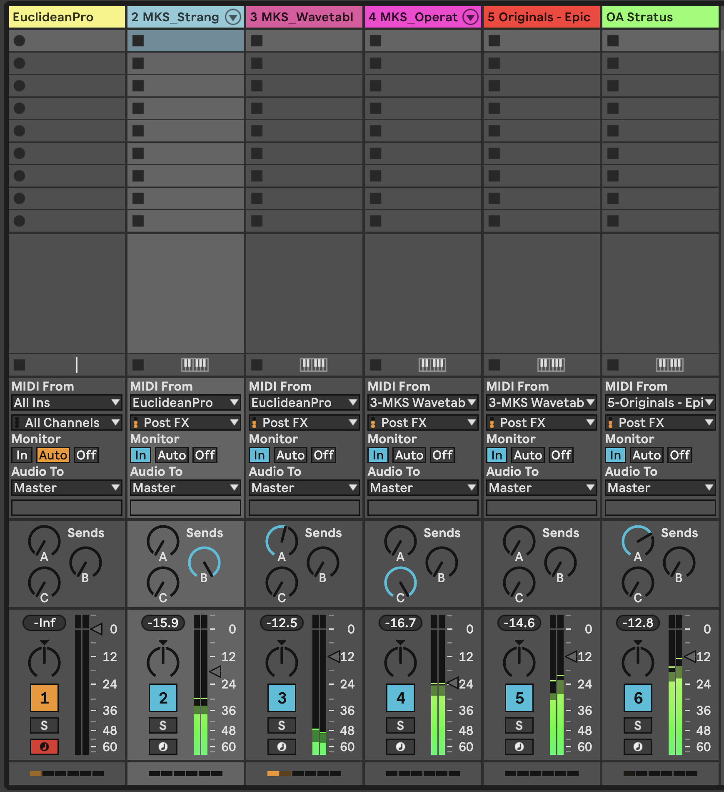

# Recipe - Using MIDI generators {#recipe-midi-generators}

In this recipe we're going to use a MIDI generator tool - Euclidean Sequencer
Pro - to generate the initial MIDI information which is then fed into additional
tracks using techniques discussed in \@ref(tools-midi-tools) and
\@ref(process-routing).

```{{r, echo = FALSE}}
knitr::opts_chunk$set(echo = FALSE, out.width = "100%")
```

1.  Place the Euclidean Sequencer Pro generator in a track. Euclidean Sequencer
Pro is a Max for Live device which can be used to generate polyrhythmic
sequences of notes, and is typically used for rhythmic patterns and because of
this, by default it only generates 4 note values. Because we're going to use it
here for more melodic output, we're going to add Random and Scale MIDI devices
so that we generate a wider range of notes.

Feel free to set up the Euclidean Sequencer Pro device to generate a variety of
pulse Events across a variety of Step values for each note. It's nice to mix up
odd and even Events, Steps and Speeds across the 4 generators. This ensures that
we don't just get a repeating pattern, although it might also be interesting to
explore a combination of predictable and more unexpected patterns (balancing the
unexpected and predictable!). We can also use modulators to shift the Rotation /
offset of the sequences to add additional unexpectedness if that's helpful.


``` r
    knitr::include_graphics(path = file.path(here::here(), "images", "Recipe4_EuclideanSequencerPro.png"))
```

<!-- -->

2.  We're now going to use many of the techniques previously seen in
\@ref(recipe-midi-tools), where we take the output from the Euclidean sequencer
and then route it to a number of different synth engines while also applying
some additional MIDI tool processing.


``` r
    knitr::include_graphics(path = file.path(here::here(), "images", "Recipe4_Routing.png"))
```

<!-- -->

First, let's take the "raw" output from the Euclidean Sequencer and route it
into a MIDI instrument track using a plucky Operator sound - could be a simple
sine wave with no sustain and fairly quick decay.


``` r
    knitr::include_graphics(path = file.path(here::here(), "images", "Recipe4_Operator.png"))
```

<!-- -->

3.  Create another MIDI instrument track where we're going to take the same
Euclidean Sequencer Pro MIDI information, but now use the MIDI Note Echo device
to delay the input by an amount (I'm using 16 16ths = 1 bar). The key thing is
to MUTE the original MIDI information. Also add a Note Length MIDI device to
turn the incoming MIDI notes into chords. We can then use these delayed and
"smeared" MIDI chords with a pad sound. I'm using Wavetable, but you can choose
a pad sound from any virtual instrument.


``` r
    knitr::include_graphics(path = file.path(here::here(), "images", "Recipe4_Pad.png"))
```

<!-- -->

4.  Create another MIDI instrument track and use the MIDI from the chord "pad"
track we've just created as the input. Be sure to set the input to "Post FX" so
that it will apply the MIDI device effects to transform the MIDI ***before***
routing it into the new track. In this track, we'll add an Arpeggiator MIDI
device. We can use a bell like tone for this track. I'm going to use Operator
again, with some modulation applied to the second modulating oscillator (which
will then vary the tone of the main Sine wave carrier oscillator). I'm also
going to apply modulation to the rate of the Arpeggiator device. You can try out
various settings here, including using an unsynced or "Free" running Arpeggiator
rate. You may need to tailor the amount or range of modulation to get
Arpeggiator rates that don't swing too far between VERY quick and VERY slow.


``` r
    knitr::include_graphics(path = file.path(here::here(), "images", "Recipe4_Arp.png"))
```

<!-- -->

5.  Feel free to continue adding additional tracks to bring texture and a
variety of tones to your track. I've included a "choir" and textured pad tracks.
Experiment with where these take the incoming MIDI information from, and how you
can manipulate the MIDI further using a variety of MIDI transformation devices.

6.  You could also experiment with other MIDI generators discussed in
\@ref(tools-midi-generators), such as Bouncy Notes, Turing Machine, Less
Concepts, etc. The MIDI generating tools provide the raw stream of MIDI notes,
but the effects here are used to provide the texture around that sequence.

7.  Press play. Sit back and relax.

------------------------------------------------------------------------

You can hear my version of this track here: [https://soundcloud.com/mikeksmith/4_euclidean_midigenerator/s-qYZKj7UnXXG](https://soundcloud.com/mikeksmith/4_euclidean_midigenerator/s-qYZKj7UnXXG?in=mikeksmith/sets/the-lazy-producer-recipes/s-PGMEWqfwKGz&si=6b1ee90238dd4a3c9fe75f66fd1f6623&utm_source=clipboard&utm_medium=text&utm_campaign=social_sharing){.uri}


