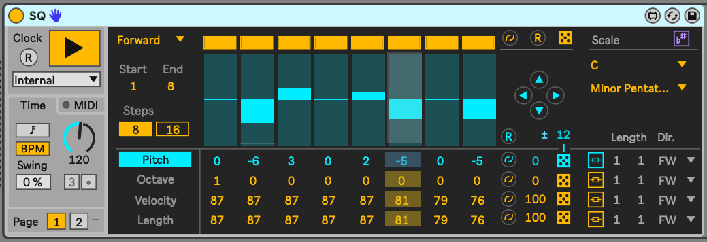
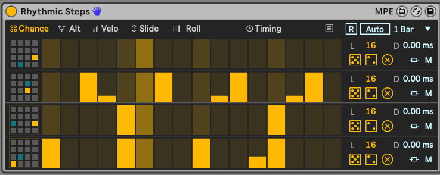
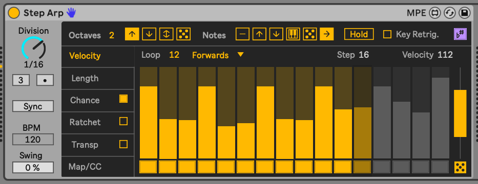

# Tools - Live 12 Sequencers

Live Suite has had Max for Live sequencer devices for some time, but with Live 12.1 some of those have now been included in a new Sequencers pack. The sequencers in this pack allow you to specify a pattern of notes, octaves, velocities, probabilities, and many other attributes and sequence these in ways that are much more like modular system sequencers, where pattern lengths may differ from number of beats in a bar, or where you can randomise aspects on the fly.

------------------------------------------------------------------------

## Key idea {.unnumbered}

Why put sequencers in a DAW (which is essentially a sequencer)? Well, because then you can specify notes you want to play, but have these play in a nonlinear way, or not follow the overall time signature of your Live set. It opens up possibilities of playing chosen notes but vary the order these are played resulting in patterns that vary but in very interesting, evolving and generative ways.

------------------------------------------------------------------------

## SQ

The SQ sequencer offers a HUGE range of tweakability to specify note pitch, octave, velocity, length, time-shift, ratchet and condition and have the sequence of values for each of these run alongside the pitch sequence or operate with a different sequence length to each other. So for example you could specify a pitch sequence, then have the note velocities change and rotate with a shorter sequence length to add some variety. Click on the "link" icons to the right of the note attributes (e.g. Velocity) to unlink the sequence for that attribute from the pitch sequence length. Clicking on the "dice" icon will randomise values. The "Length" attribute defines the length of the sequence, while the "Dir" setting defines the sequence play order - the sequences also don't need to run forward, but can run in reverse, ping-pong back and forth (running forward then backward then forward), in a "snake" pattern or randomly. You can have the sequence be scale aware so that notes respect the Global Scale setting. You can change the starting note of the sequence by playing a different MIDI note. You can set the clock for the sequence to run at a different rate to the Global BPM setting in the Live set, or even set the clock from an external device. MIDI pitch information can be entered through the Pitch lane, or can be entered via a Step Sequenceer within the MIDI tab.


```r
knitr::include_graphics(path = file.path(here::here(), "images", "Live12_SQ.png"))
```

<!-- -->

This is a really powerful sequencer then, that can provide endless variation and interest from fairly simple patterns.

## Rhythmic Steps

Rhythmic Steps is quite similar in some ways to the SQ sequencer, in that we can define the sequence of certain attributes - chance, velocity, MPE slide, and roll - and vary the sequence length of each of these if we wish. Rhythmic Steps is set up to work with Drum Racks (you can see which note is going to be played from the Drum Rack in the left hand side graphic). The "Alt" attribute is interesting as it allows you to specify the probability of playing an alternate sound (in blue in the Drum Rack graphic), so you could mix closed hi-hat (second from top row) with an open hi-hat sound.


```r
knitr::include_graphics(path = file.path(here::here(), "images", "Live12_RhythmicSteps.png"))
```

<!-- -->

You can also reset the pattern (using the [R] or [Auto] buttons in the image above) so that the patterns will start back at step 1 again. The [Auto] setting allows you to specify a number of bars after which the reset will happen if you don't want to manually trigger this. The icon to the left of the [R] reset button shows how the Rhythm Sequencer can be used directly from Ableton's Push controller.

## Step Arp

Much like the above sequencers, Step Arp allows you to tweak and sequence the attributes of an arpeggiator and have the sequence of those attributes run in parallel with the pitch sequence which is governed through the Octave and Notes button settings or unlinked to sequence the attributes with different lengths.


```r
knitr::include_graphics(path = file.path(here::here(), "images", "Live12_StepArp.png"))
```

<!-- -->

The bar to the right of the sequence allows you to specify a range in which the values will be randomised, so here this would affect the range of velocities that would be randomised.
